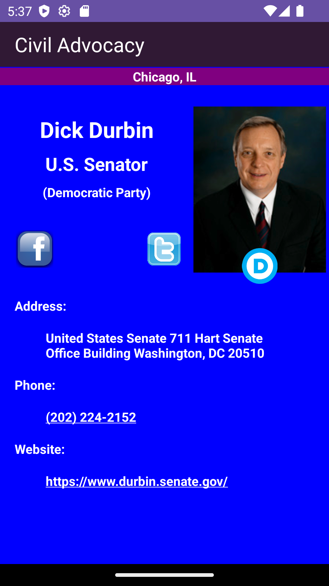

Application that retrieve information about political officials. Applications uses android location services and the Google Civic API. Information such as name, image, political party, address, work phone, and social media platforms are displayed.
If no image is found then a stock image is displayed. 

# Application Start Asking for Location Permission

# Permission Given 

# Permission Denied

# Search Address And Results

# Official's Info

# Closed Up Image

# Facebook Page (if avaliable)

# Twiiter Page (if avaliable)

# Phone Number 

# Website

# No Internet Connection

# Copyright Page

